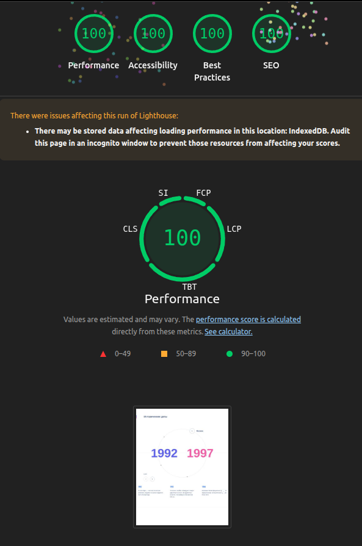
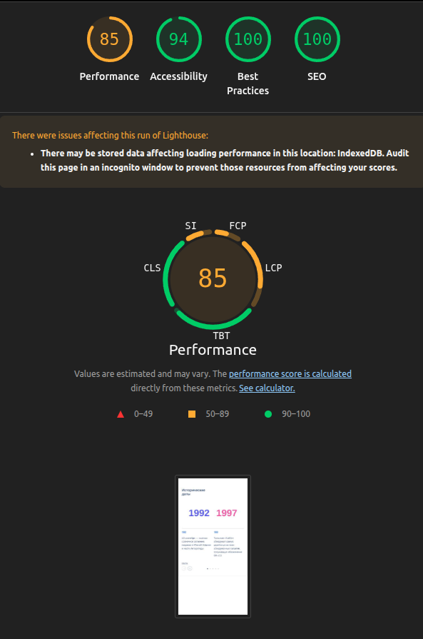

<br>


# Сompound slider:&nbsp;&nbsp;&nbsp;`Historical dates`<br>

#### `Historical dates` - это слайдер разработанный на базе `React`, `TypeScript`, `SCSS` и библиотеки `Swiper`.<br><br>:warning: Настроены линтеры `Eslint` и `Stylelint`.<br>:pager: Адаптирован под мобильные устройства.<br>:octocat: Так же развёрнута `demo`-версия на `GitHub Pages`.<br><br><br>

## Стек технологий

&nbsp;&nbsp;&nbsp;&nbsp;&nbsp;&nbsp;&nbsp;&nbsp;&nbsp;&nbsp;&nbsp;&nbsp;&nbsp;&nbsp;&nbsp;&nbsp;&nbsp;&nbsp;
<br><br><br>

## Demo

`Link:`&nbsp;&nbsp;&nbsp;<a target="_blank" rel="noopener noreferrer" href="https://abubjazov.github.io/Historical_Dates/">Go to Historical dates on GitHub Pages</a><br><br><br>

## Отчёты Lighthouse

**Desktop**<br><br>
<br><br>

**Mobile**<br><br>
<br><br><br>

## Установка `npm-пакетов` и сборка проекта


```
npm install         //установить все необходимые пакеты

npm start           //произвести "dev" сборку и запустить её на локальном хосте

npm run build       //произвести "production" сборку
```

<br>

## Линтинг кода `TS`


```
npm run lint        //запустить линтер

npm run lint:fix    //запустить линтер в режиме автоматического исправления ошибок
```

<br>

## Линтинг стилей `SCSS`


```
npm run styles      //запустить линтер стилей

npm run styles:fix  //запустить линтер в режиме автоматического исправления ошибок
```

<br>

## Развертывание на `GitHub Pages`


```
npm run deploy      //деплой на GitHub Pages
```
